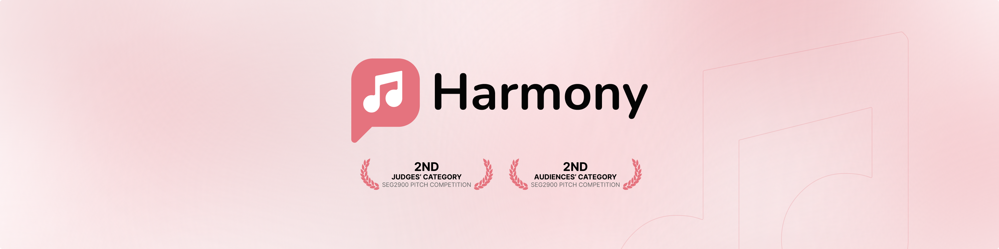

<h1>Harmony</h1>

Group project for startup pitch competition in the SEG 2900 course.

    
    

<h2>Background</h2>

Harmony connects people with new friends using the language of music.

It was created in three months by a team of five Software Engineering students from the University of Ottawa as part of the SEG 2900 course.

<h2>Development</h2>

HTML, CSS, JavaScript, Figma, and Git were all part of the tech stack.

Each team member added a webpage to the website.

The team met weekly to discuss ideas and offer progress reports on their state.

<h2>Result</h2>

The team was among three selected from 28 groups to present their startup idea to a 200-person audience, including a panel of three CEOs and founders from the Ottawa area.

Harmony placed second in both the audience and judges categories.

    
    

